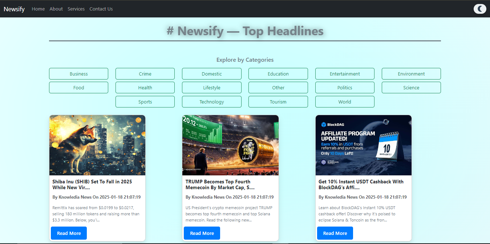

## Screenshots



# Newsify - Real-time News App

Newsify is a modern, user-friendly news aggregation platform that brings real-time updates from across the globe. It offers custom news feeds, real-time alerts, and an intuitive interface to keep you informed about the latest happenings in tech, business, sports, and more.

This project uses the **NewsData API** for fetching real-time news, **React** for the front-end, and **Vite** for fast and optimized build processes. The application is designed to give users a seamless and personalized news experience.

---

## Features

- **Real-Time News**: Get live news updates across various categories such as tech, business, sports, and more.
- **Customizable News Feeds**: Personalize the content based on your interests.
- **Smooth User Interface**: A clean, modern interface built with **Bootstrap** and **React**.
- **Loading Skeletons**: A smooth user experience during data fetching.
- **Responsive Design**: Optimized for both desktop and mobile devices.
- **Alert Notifications**: Stay up-to-date with real-time alerts for breaking news.
- **Multi-Section Layout**: Includes an About section, Contact Us page, and more.

---

## Installation

To get started with Newsify locally, follow these steps:

### 1. Clone the repository

```bash
git clone https://github.com/vishallokhande8788/newsify.git
cd newsify
```

### 2. Install dependencies

```bash
pnpm install
```

### 3. Run the development server

```bash
pnpm run dev
```

Visit http://localhost:3000 to view the app in your browser.

## Tech Stack

Frontend:

- React (v18+)
- Bootstrap (v5.3.3)
- React Router (for navigation)
- React Icons (for icons)
- React Loading Skeleton (for smooth UI)

Backend:

- NewsData API (for fetching real-time news)

Development Tools:

- Vite (for fast and optimized development environment)
- ESLint (for code quality)


## Future Features

- User Authentication: To save personalized preferences and news feeds.
- Bookmarking: Save your favorite news stories.
- Dark Mode: Switch to a darker theme for a better reading experience at night.
- Advanced Search: Allow users to search news based on keywords and topics.

## Contributing

Contributions are welcome! If you have any suggestions or bug fixes, feel free to create a pull request or open an issue.

## Steps to contribute:

1. Fork the repository.
2. Create a new branch (git checkout -b feature-name).
3. Commit your changes (git commit -am 'Add feature').
4. Push to the branch (git push origin feature-name).
5. Create a new Pull Request.

---
## Tech Stack
Frontend:
- React (v18+)
- Bootstrap (v5.3.3)
- React Router (for navigation)
- React Icons (for icons)
- React Loading Skeleton (for smooth UI)
Backend:
- NewsData API (for fetching real-time news)
Development Tools:
- Vite (for fast and optimized development environment)
- ESLint (for code quality)
# License 
    This project is licensed under the MIT License - see the LICENSE file for details.


# Acknowledgments
NewsData API for providing access to real-time news data.
React and Vite for making modern web development faster and easier.
Bootstrap for quick and responsive design solutions.  